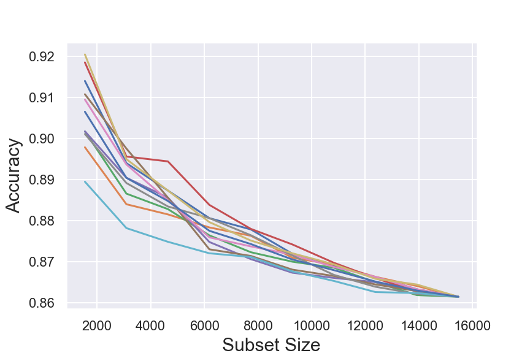

# Genre and Gender
### Project Team Members: Daniel Fox and Tom Johnson
- To explore this project in more detail run the Jupyter notebook main.ipynb. You may need to first set up a virtual environment to have the correct dependencies:
	- ```$ pip install -r requirements.txt```
	- ```$ jupyter notebook &```
	- open the notebook main.ipynb
	- switch the kernel to genre_env. 
	- run the notebook  
- Try the [prototype](http://18.222.33.220:8501/) for our web app that allows users to explore the relationships between artists, genres, and gender in the dataset of ~15,000 artists.
## Introduction
Digital repositories of knowledge such as Wikipedia continue to use music classification systems derived from prejudiced hierarchical systems. Despite initial claims of neutral algorithmic approaches, broad research has shown how automation perpetuates the existing social inequities. Within music culture it is thus important to ask, Is there gender bias in the genre labels for musicians on Wikipedia? Our project answers this question in the affirmative using a dataset of ~15,000 music artists labeled with their genders and genres. We have shown that female artists are significantly under represented within the set of artists with six or more genre labels. 

In the context of music studies, our work refines the understanding of how digital databases are reinforcing historical social inequities. 

## Project Description

Is there gender bias in the genre labels for musicians on Wikipedia? This project provides an affirmative answer by combining humanistic and data driven approaches. Research has shown that 21st-century repositories of knowledge residing in media(ting) services like Google or Wikipedia re-inscribe systemic asymmetries.  Rather than sidestepping social bias, automation amplifies existing social inequities.  On Wikipedia, only 15% of biographical articles are about women (Graells-Garrido et al, 2015).  More subtle metrics reveal systematic gender bias in more than just article counts. Wagner et al. demonstrate lexical bias (female is the marked gender) and “assortativity” bias (articles about women are more likely to link to men than the other way around).  

As music listening is increasingly influenced by online databases and recommendation systems, the domain-specific cultural practices encoded in music genre labeling is amplified. Classification of musical types has been guided by prejudiced groupings of musicians and audiences.  If Wikipedia’s metadata reflects this hierarchical tradition, then we expect genres to be unevenly associated with male and female artists. Moving beyond the mere preponderance of male artists, our research reveals one of the modes through which genre labeling amplifies gender bias.  

### The Data

Our cleaned data set of 15,470 music artists includes names, genders, and the music genres from their Wikipedia infoboxes. Starting from a dataset on Kaggle.com containing the name and gender of singers, we scraped genre metadata from Wikipedia.  Removing artists for which the scraper could not retrieve genre labels reduced the dataset from ~22,000 to ~15,000 artists. We verified the gender on a random sample (1% of our corpus) by referencing pronoun usage for each artist on the artist website, social media page, or Wikipedia entry. Of this 1%, we verified the accuracy of 153/154 to be correct, the incorrect item being a band of multiple people. We dropped all bands from the corpus, reducing our dataset by roughly 25 items. Significant cleaning was required to deal with spelling irregularities. Further, because genre labels are not standardized, we used domain specific knowledge about music genres to make decisions about when to equate labels: “rock & roll” was equated with “rock n roll” but their joint category was kept distinct from “rock.” After imposing these equivalences, there were 1,494 distinct genre labels. Many artists have a single genre label, such as “pop,” whereas one artist had 73 genre labels. The gender breakdown is 31% female and 69% male.

There are inherent limits to the accuracy of any model that classifies the gender of an artist based on their genre labels alone. This arises because, for most genre lists, such as [pop, rock, blues], there will be both female and male artists with those three labels. For this particular data set, the upper bound decreases on subsamples. The graph below shows the upper bound for accuracy on 10 different randomly selected nested subsets.



### Methods of Analysis

We analyze the correlation between inferred binary gender labels and the number of genre labels present in Wikipedia infoboxes for musicians. We compare the observed number of female and male artists with a given number (or numerical range) of genres to the expected number of artists given the percentages of female and male artits in the total population, 31% female and 69% male. The null hypothesis is that there is no correlation between gender and the number of genre labels. We apply $\chi^2$-tests and report the p-values to measure the probability that the observed correlations would arise from chance if the null hypothesis were true. We analyze the data using two levels of detail.

#### 11 Bins

We divide artists into 11 groups. These groups correspond to the number of labels that each artist in the group has, except for the last group, "11+", which counts all artists with 11 or more labels. It is worth noting that, in the current data set, there are 7 female artists with 11 genre labels but no female artists with 12 or more labels. We use the 11+ category to avoid computational problems for the $\chi^2$-test.

#### 2 Bins

use box plots to identify that the ratio of actual to expected numbers of female and male artists varies with the number of genre labels assigned to the artist. 

### Conclusions

We have shown that in this data set of 15470 music artists from Wikipedia, there is a significant correlation between the number of genres assigned to an artist and their gender. In particular, male artists are more likely than female artists to have 6 or more genre labels assigned to them.

Our analysis shows that female artists are under-represented within the category of artists having at least six genre labels assigned to them, whereas there is no gender bias with regard to the number of genre labels for artists with five or less labels. (See the box plots below.)

### For 1-5 genre labels there is little gender bias. But for >5 genre labels, female artists are underrepresented. 


We also show that there is a nontrivial upper bound for the accuracy of any model that tries to predict gender based on the genre labels of an artist. On the full sample the bound is 86%; on subsamples of size 2000 the expected value of the upper bound is 90%.

## Bios:

Daniel Fox is a doctoral candidate in Music at The Graduate Center, CUNY. His writing on music has appeared in Perspectives of New Music and Hyperallergic. His dissertation examines how technology and performance practices used within American experimental music shape our ideas about what is natural. He holds a PhD in mathematics from Duke University and has published math research in the Transactions of the American Mathematical Society and Communications in Analysis and Geometry. His compositions have been performed by the Jack Quartet and Talea Ensemble.

Tom Johnson is a Visiting Assistant Professor of Music at Skidmore College. His current research focuses on streaming services and musical genre. He is particularly interested in how our musical experiences are mediated by (and in turn mediate) technologies like Spotify or Apple music. Tom has published on race in twenty-first century technologies, the role of tonality in early-20th-century modernist practices and on some recent literature on popular music genres.
